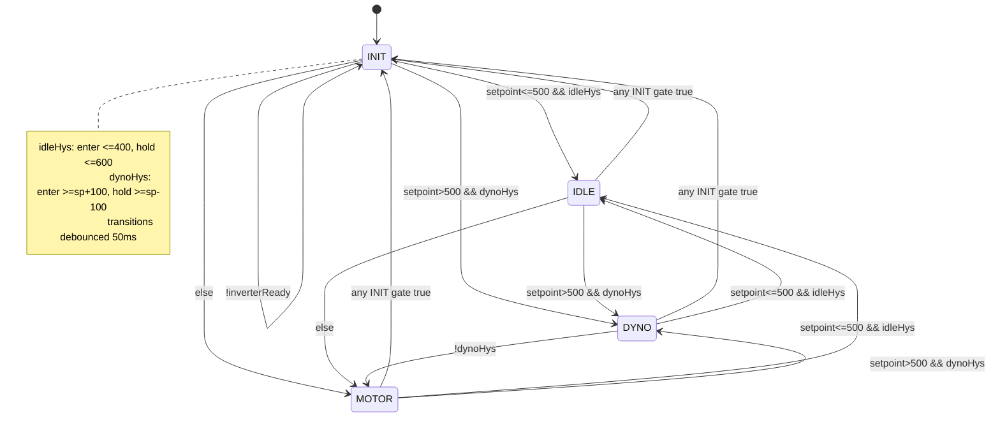

# MetaSense Dyno

MetaSense dyno firmware and web UI for ESP32-S3, built with PlatformIO.

## What This Repo Contains

- Firmware: task-based control, sensor acquisition, safety interlocks, outputs.
- Web UI (LittleFS): live dashboard, settings, trend/report views, capture tools.
- Persistent settings and run storage.

## Environments

- `esp32s3-USB`: local flashing over USB.
- `esp32s3-ota`: OTA flashing to device on network.

## Quick Start

Build:

```powershell
platformio run -e esp32s3-USB
```

Upload firmware:

```powershell
platformio run -e esp32s3-USB -t upload
```

Upload web UI (LittleFS):

```powershell
platformio run -e esp32s3-USB -t uploadfs
```

OTA equivalents:

```powershell
platformio run -e esp32s3-ota -t upload
platformio run -e esp32s3-ota -t uploadfs
```

## Current Runtime (Important)

- Control loop period: `25 ms` (40 Hz).
- Modbus publisher period: `50 ms`.
- WebSocket telemetry publish limiter: `50 ms`.

Task split:

- Control task: computes telemetry and physical outputs.
- Network task: WebSocket/UI/OTA.
- Modbus task: register publishing.

Physical outputs are updated by control task cadence, not by GUI refresh rate.

## Load-Cell Filtering

Two selectable modes:

- Mode A (`moving_avg`): Stage-1 moving average + alpha stage.
- Mode B (`two_stage_ma`): Stage-1 moving average + Stage-2 moving average.

Window parameters:

- `loadAvgN` = Stage-1 window.
- `loadAvgN2` = Stage-2 window (Mode B only).
- Valid range: `1..48`.

At `T_s = 0.025 s`, two-stage MA delay is approximately:

$$
	au \approx \frac{N_1 + N_2 - 2}{2} \cdot T_s
$$

Example: `N1 = N2 = 48` gives about `1.175 s` filter delay.

## Display vs Telemetry Precision

- Firmware sends high-resolution telemetry (e.g. power/torque/load with finer decimals).
- GUI rounds independently for readability (power and torque shown with 1 decimal).

This keeps charts/storage precise without making the dashboard noisy.

## Safety Notes

- VCU ready (`RB+`) is enforced as a run interlock.
- If interlock drops, runtime moves to safe output state.
- Respect hardware limits and verify wiring before high-load operation.

## Runtime HWSM State Machine

Source of truth: `src/HardwareOutputStateMachine.cpp`.

Primary states:

- `INIT`
- `IDLE`
- `MOTOR`
- `DYNO`

Transition evaluation order (every control update):

1. `INIT` if inverter status is not initialized.
2. `INIT` if precharge has failed (`prestart warning` latched).
3. `INIT` if precharge is not yet completed.
4. `INIT` if inverter is not ready.
5. `IDLE` if setpoint is at or below `500 RPM` and RPM satisfies idle hysteresis.
6. `DYNO` if setpoint is above `500 RPM` and RPM satisfies dyno hysteresis.
7. `MOTOR` otherwise.

State transition debounce:

- Candidate state must be stable for `50 ms` before commit.

RPM hysteresis currently applied:

- Idle hysteresis around `500 RPM`:
	- Enter `IDLE` at `RPM <= 400`
	- Stay `IDLE` until `RPM > 600`
- Dyno hysteresis around setpoint (only when `setpoint > 500 RPM`):
	- Enter `DYNO` at `RPM >= setpoint + 100`
	- Stay `DYNO` while `RPM >= setpoint - 100`

Precharge sub-flow (inside `INIT`):

- Minimum precharge dwell: `2500 ms`
- HV-ready threshold: `300 V`
- Current success criterion in code:
	- `HV >= 300 V`, or
	- `(elapsed >= 2500 ms) and inverterReady`
- Timeout handling at `2500 ms` if still not successful:
	- Test mode (`METASENSE_PRECHARGE_TEST_ACCEPT_TIMEOUT=1`): accept completion.
	- Normal mode (`METASENSE_PRECHARGE_TEST_ACCEPT_TIMEOUT=0`): latch prestart warning/failure and hold in `INIT` with relays off.

Relay intent by state (firmware output mapping):

- `INIT`: SSR on, RB- off, precharge active during sequence, RB+ after precharge success.
- `IDLE`: RB- on, SSR off, RB+ held (post-precharge).
- `MOTOR`: SSR on, RB- off, RB+ held.
- `DYNO`: RB- on, SSR off, RB+ held.
- Any fault or precharge-failed latch: all relays forced off.

Mermaid overview:



## Useful Files

- `src/main.cpp`: task scheduling, startup, web server routes.
- `src/Input.cpp`: sensor pipeline, filters, control-side telemetry flow.
- `src/Settings.cpp`: persisted settings and validation.
- `src/CommandRouter.cpp`: WebSocket command handling and settings API.
- `data/index.html`: main dashboard UI.
- `data/settings.html`: settings UI.

## Typical Dev Loop

1. Edit firmware (`src/**`) and/or UI (`data/**`).
2. Build and upload firmware when C++ changed.
3. Upload LittleFS when HTML/JS/CSS changed.
4. Verify behavior on dashboard and on physical outputs.

## Git Hygiene

Before committing:

```powershell
git status --short
```

Recommended split commits:

- firmware logic
- web UI
- docs

- Adjust Kp via Pot3 in small increments while monitoring overshoot and settling.
- Tune Ki in settings only after Kp behavior is stable.
- Re-test interlock behavior after each significant tuning change.